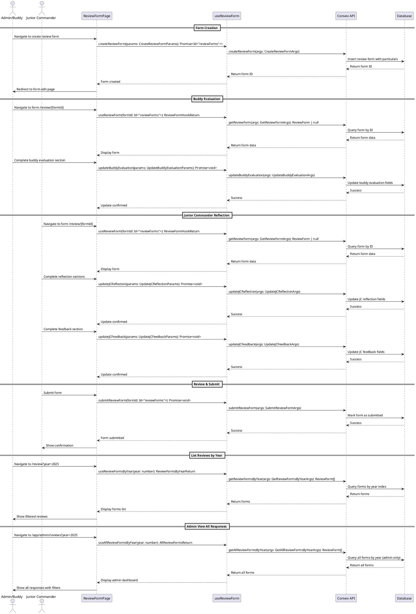

# JCEP Review Form Codemap

## Title

JCEP 2025 Rotation Review Form Management

## Description

Digital implementation of the Junior Commander Exposure Programme (JCEP) rotation review form. This feature allows Junior Commanders and their assigned Buddies to complete multi-stage evaluations tracking rotation performance, reflections, and program feedback. The system supports collaborative form completion where both parties contribute their sections, with proper tracking by rotation year and participant.

## Implementation Overview

- **Frontend routing & UX**

  - Primary entry points live under `apps/webapp/src/app/app/review/*` for participants and `/app/admin/reviews` for admins.
  - Version-agnostic list/detail pages delegate to versioned UI components in `apps/webapp/src/modules/review/components/`, ensuring that each `schemaVersion` maps cleanly to a self-contained UI implementation.
  - Shared hooks in `apps/webapp/src/modules/review/hooks/useReviewForm.ts` provide a single data access layer for all review form interactions (create, read, update, submit) and expose computed state (e.g. section completion, edit permissions).

- **Backend API & persistence**

  - Convex functions in `services/backend/convex/reviewForms.ts` implement all query and mutation contracts, using session-aware arguments (via `SessionIdArg` in implementation) to enforce authentication and authorization.
  - The `reviewForms` table in `services/backend/convex/schema.ts` persists all particulars, section responses, and meta fields, with indexes optimized for rotation year, status, and participant lookups.

- **Contracts & shared types**

  - Frontend TypeScript types in `apps/webapp/src/modules/review/types.ts` mirror the Convex `ReviewFormDoc` shape, aligning on section structures, status enums, and ID fields.
  - Contracts in this codemap define the exact query/mutation signatures and argument types, forming the stable boundary between frontend hooks and backend Convex functions.

- **Versioning & evolution**
  - A numeric `schemaVersion` on each document, plus `CURRENT_REVIEW_FORM_SCHEMA_VERSION` / `SUPPORTED_SCHEMA_VERSIONS` constants on the frontend and a `CURRENT_SCHEMA_VERSION` constant on the backend, coordinate how new forms are created and routed.
  - Question text is always stored alongside answers, so wording changes do not require schema migrations, and multiple schema versions can coexist while sharing the same admin reporting surface.

## User Flow Analysis

**Note**: V2 enhancements planned - see `jcep-review-form-v2-enhancements.plan.md` for token-based access and visibility controls.

Based on the paper form structure, the optimal digital flow is:

### Stage 1: Form Initialization (By Admin) **[V2: Enhanced]**

- **V1 (Current)**: Admin or Buddy creates form with both names assigned
- **V2 (Planned)**: Admin pre-creates form, system generates secret access tokens
  - Buddy receives unique link: `/review/token/{buddyToken}`
  - JC receives unique link: `/review/token/{jcToken}`
  - Tokens allow anonymous access before account linking
  - Admin controls when responses become visible to each party

### Stage 2: Buddy Evaluation Section (By Buddy) **[V2: Visibility Control]**

- **V1 (Current)**: Buddy completes section, JC can see immediately
- **V2 (Planned)**: Buddy completes section, hidden from JC until admin reveals
  - Buddy accesses via token link (anonymous) or account (if linked)
  - Responses saved but marked as hidden from JC
  - Admin toggles `buddyResponsesVisibleToJC` flag when ready

- Buddy completes their evaluation section:
  1. Lists tasks the Junior Commander participated in
  2. Documents Junior Commander's strengths and areas of excellence
  3. Identifies areas for improvement with examples
  4. Provides words of encouragement and guidance

### Stage 3: Junior Commander Reflection (By Junior Commander) **[V2: Visibility Control]**

- **V1 (Current)**: JC completes section, Buddy can see immediately
- **V2 (Planned)**: JC completes section, hidden from Buddy until admin reveals
  - JC accesses via token link (anonymous) or account (if linked)
  - Responses saved but marked as hidden from Buddy
  - Admin toggles `jcResponsesVisibleToBuddy` flag when ready

- Junior Commander completes their section:
  1. Documents next rotation preference (RK/DR/AR/ER)
  2. Describes memorable/impactful activities participated in
  3. Reflects on learnings from JCEP experience (devotions, ministry impact)
  4. Identifies what they would have done differently in current rotation
  5. Sets goals and prayer requests for next rotation

### Stage 4: Feedback to Buddy (By Junior Commander)

- Junior Commander provides:
  1. Words of encouragement/gratitude to their Buddy
  2. Feedback for the JCEP programme (positive feedback and areas for improvement)

### Stage 5: Review & Submit **[V2: Admin-Controlled Reveal]**

- **V1 (Current)**: Both parties can review immediately, either can submit
- **V2 (Planned)**: Admin controls visibility, then parties can review
  - Admin reveals responses when appropriate
  - Both parties review (now seeing each other's responses)
  - Either party can submit to finalize
  - Form is archived under the specific rotation year

**V2 Additional Feature**: Buddy Dashboard
- Buddy can view `/app/review/my-jcs` to see all assigned JCs
- Aggregated view of all forms where they are the buddy
- Quick access to edit any form
- Status tracking across all assignments

## Data Model Considerations

**Key Requirements:**

- Store responses at user level (track who completed which section)
- Index by rotation year for historical reporting
- Support draft/in-progress state (not all sections completed at once)
- Track completion status per section
- Support both Buddy and Junior Commander access to the same form
- **Version the form schema** using an integer version number (increment only on breaking changes)
- **Capture question text with each response** to preserve context when questions change
- **Organize UI components by version** (v1, v2, etc.) for complete isolation between schema versions
- **Admin view** to list and filter all responses by year across all users

## Sequence Diagram



## Frontend Entry Point / Route

- `apps/webapp/src/app/app/review/page.tsx` - List user's review forms (with year filter)
  - **Search Parameters**: `year` - Filter by rotation year (e.g., ?year=2025)
- `apps/webapp/src/app/app/review/create/page.tsx` - Create new review form (Admin/Buddy only)
- `apps/webapp/src/app/app/review/[formId]/page.tsx` - View/edit specific review form (routes to versioned component)
  - **URL Parameters**: `formId` - The ID of the review form (`Id<"reviewForms">`)
- `apps/webapp/src/app/app/review/[formId]/layout.tsx` - Layout wrapper for review form pages
- `apps/webapp/src/app/app/admin/reviews/page.tsx` - Admin dashboard to view all review forms
  - **Search Parameters**: `year` - Filter by rotation year (e.g., ?year=2025)
  - **Search Parameters**: `status` - Filter by form status (draft/in_progress/submitted)
  - **Search Parameters**: `ageGroup` - Filter by age group (RK/DR/AR/ER)

## Frontend Components

### Shared Components (Version-agnostic)

- `apps/webapp/src/modules/review/components/ReviewFormList.tsx` - List of review forms with year filter
- `apps/webapp/src/modules/review/components/ReviewFormCard.tsx` - Summary card for a review form
- `apps/webapp/src/modules/review/components/ReviewFormRouter.tsx` - Routes to correct version component based on form schema version
- `apps/webapp/src/modules/review/components/AgeGroupSelect.tsx` - Dropdown for selecting age group (RK/DR/AR/ER)

### Admin Components

- `apps/webapp/src/modules/review/components/admin/AdminReviewDashboard.tsx` - Admin dashboard for viewing all reviews
- `apps/webapp/src/modules/review/components/admin/AdminReviewFilters.tsx` - Filter controls for admin view
- `apps/webapp/src/modules/review/components/admin/AdminReviewTable.tsx` - Table view of all reviews with sorting
- `apps/webapp/src/modules/review/components/admin/AdminReviewExport.tsx` - Export functionality for admin reports

### Version 1 Components (Schema Version 1)

- `apps/webapp/src/modules/review/components/v1/ReviewFormCreate.tsx` - Form creation wizard (v1)
- `apps/webapp/src/modules/review/components/v1/ReviewFormView.tsx` - Main form view container (v1)
- `apps/webapp/src/modules/review/components/v1/ParticularsSection.tsx` - Particulars section (v1)
- `apps/webapp/src/modules/review/components/v1/BuddyEvaluationSection.tsx` - Buddy evaluation form section (v1)
- `apps/webapp/src/modules/review/components/v1/JCReflectionSection.tsx` - Junior Commander reflection form section (v1)
- `apps/webapp/src/modules/review/components/v1/JCFeedbackSection.tsx` - Junior Commander feedback form section (v1)
- `apps/webapp/src/modules/review/components/v1/ReviewFormProgress.tsx` - Visual indicator of form completion status (v1)
- `apps/webapp/src/modules/review/components/v1/formQuestions.ts` - Question text constants for v1 schema

## Frontend Service Layer

- `apps/webapp/src/modules/review/hooks/useReviewForm.ts` - Main data hook for review forms

  - **Functions**:
    ```typescript
    useReviewForm(formId: Id<"reviewForms">): ReviewFormHookReturn
    useReviewFormsByYear(year: number): ReviewFormsByYearReturn
    useAllReviewFormsByYear(year: number): AllReviewFormsReturn // Admin only
    createReviewForm(params: CreateReviewFormParams): Promise<Id<"reviewForms">>
    updateParticulars(params: UpdateParticularsParams): Promise<void>
    updateBuddyEvaluation(params: UpdateBuddyEvaluationParams): Promise<void>
    updateJCReflection(params: UpdateJCReflectionParams): Promise<void>
    updateJCFeedback(params: UpdateJCFeedbackParams): Promise<void>
    submitReviewForm(formId: Id<"reviewForms">): Promise<void>
    ```

- `apps/webapp/src/modules/review/types.ts` - Frontend type definitions

  ```typescript
  import { Id } from "convex/_generated/dataModel";

  // Age group options
  export type AgeGroup = "RK" | "DR" | "AR" | "ER";

  // Form completion status
  export type ReviewFormStatus = "draft" | "in_progress" | "submitted";

  // Schema version for form structure
  export type ReviewFormSchemaVersion = 1; // Increment for breaking changes

  // Section completion tracking
  export interface SectionCompletion {
    particulars: boolean;
    buddyEvaluation: boolean;
    jcReflection: boolean;
    jcFeedback: boolean;
  }

  // Question with captured text for versioning
  export interface QuestionResponse {
    questionText: string; // The question as it was when answered
    answer: string;
  }

  // Review form entity (Version 1)
  export interface ReviewForm {
    _id: Id<"reviewForms">;
    _creationTime: number;

    // Schema version for data migration and UI routing
    schemaVersion: ReviewFormSchemaVersion;

    // Particulars
    rotationYear: number;
    buddyUserId: Id<"users">;
    buddyName: string;
    juniorCommanderUserId: Id<"users"> | null; // Null if JC is not a registered user
    juniorCommanderName: string;
    ageGroup: AgeGroup;
    evaluationDate: number; // timestamp

    // Next rotation preference (filled by JC)
    nextRotationPreference: AgeGroup | null;

    // Buddy Evaluation Section (with question text captured)
    buddyEvaluation: {
      tasksParticipated: QuestionResponse;
      strengths: QuestionResponse;
      areasForImprovement: QuestionResponse;
      wordsOfEncouragement: QuestionResponse;
      completedAt: number | null;
      completedBy: Id<"users"> | null;
    } | null;

    // Junior Commander Reflection Section (with question text captured)
    jcReflection: {
      activitiesParticipated: QuestionResponse;
      learningsFromJCEP: QuestionResponse;
      whatToDoDifferently: QuestionResponse;
      goalsForNextRotation: QuestionResponse;
      completedAt: number | null;
      completedBy: Id<"users"> | null;
    } | null;

    // Junior Commander Feedback Section (with question text captured)
    jcFeedback: {
      gratitudeToBuddy: QuestionResponse;
      programFeedback: QuestionResponse;
      completedAt: number | null;
      completedBy: Id<"users"> | null;
    } | null;

    // Meta
    status: ReviewFormStatus;
    submittedAt: number | null;
    submittedBy: Id<"users"> | null;
    createdBy: Id<"users">;
  }

  // Hook return types
  export interface ReviewFormHookReturn {
    form: ReviewForm | undefined | null;
    isLoading: boolean;
    error: string | null;
    sectionCompletion: SectionCompletion;
    canEditBuddySection: boolean;
    canEditJCSection: boolean;
  }

  export interface ReviewFormsByYearReturn {
    forms: ReviewForm[] | undefined;
    isLoading: boolean;
    error: string | null;
  }

  export interface AllReviewFormsReturn {
    forms: ReviewForm[] | undefined;
    isLoading: boolean;
    error: string | null;
    totalCount: number;
  }

  // Mutation parameter types
  export interface CreateReviewFormParams {
    rotationYear: number;
    buddyUserId: Id<"users">;
    buddyName: string;
    juniorCommanderUserId: Id<"users"> | null;
    juniorCommanderName: string;
    ageGroup: AgeGroup;
    evaluationDate: number;
  }

  export interface UpdateParticularsParams {
    formId: Id<"reviewForms">;
    buddyName?: string;
    juniorCommanderName?: string;
    ageGroup?: AgeGroup;
    evaluationDate?: number;
  }

  export interface UpdateBuddyEvaluationParams {
    formId: Id<"reviewForms">;
    tasksParticipated: QuestionResponse;
    strengths: QuestionResponse;
    areasForImprovement: QuestionResponse;
    wordsOfEncouragement: QuestionResponse;
  }

  export interface UpdateJCReflectionParams {
    formId: Id<"reviewForms">;
    nextRotationPreference: AgeGroup;
    activitiesParticipated: QuestionResponse;
    learningsFromJCEP: QuestionResponse;
    whatToDoDifferently: QuestionResponse;
    goalsForNextRotation: QuestionResponse;
  }

  export interface UpdateJCFeedbackParams {
    formId: Id<"reviewForms">;
    gratitudeToBuddy: QuestionResponse;
    programFeedback: QuestionResponse;
  }
  ```

- `apps/webapp/src/modules/review/utils/formValidation.ts` - Form validation utilities

  - **Functions**:
    ```typescript
    validateParticulars(data: Partial<CreateReviewFormParams>): ValidationResult
    validateBuddyEvaluation(data: Partial<UpdateBuddyEvaluationParams>): ValidationResult
    validateJCReflection(data: Partial<UpdateJCReflectionParams>): ValidationResult
    validateJCFeedback(data: Partial<UpdateJCFeedbackParams>): ValidationResult
    ```

- `apps/webapp/src/modules/review/constants/schemaVersions.ts` - Schema version constants
  - **Constants**:
    ```typescript
    export const CURRENT_REVIEW_FORM_SCHEMA_VERSION = 1;
    export const SUPPORTED_SCHEMA_VERSIONS = [1] as const;
    ```

## Backend Function Entry Point

- `services/backend/convex/reviewForms.ts` - Main backend file for review forms

  - **Functions**:

    ```typescript
    // Queries
    getReviewForm(args: GetReviewFormArgs): Promise<ReviewForm | null>
    getReviewFormsByYear(args: GetReviewFormsByYearArgs): Promise<ReviewForm[]>
    getReviewFormsByUser(args: GetReviewFormsByUserArgs): Promise<ReviewForm[]>
    getAllReviewFormsByYear(args: GetAllReviewFormsByYearArgs): Promise<ReviewForm[]> // Admin only

    // Mutations
    createReviewForm(args: CreateReviewFormArgs): Promise<Id<"reviewForms">>
    updateParticulars(args: UpdateParticularsArgs): Promise<void>
    updateBuddyEvaluation(args: UpdateBuddyEvaluationArgs): Promise<void>
    updateJCReflection(args: UpdateJCReflectionArgs): Promise<void>
    updateJCFeedback(args: UpdateJCFeedbackArgs): Promise<void>
    submitReviewForm(args: SubmitReviewFormArgs): Promise<void>
    deleteReviewForm(args: DeleteReviewFormArgs): Promise<void>
    ```

### Contracts

```typescript
import { Id } from "./_generated/dataModel";
import { v } from "convex/values";

// Schema version constant
export const CURRENT_SCHEMA_VERSION = 1;

// Age group validator
export const ageGroupValidator = v.union(
  v.literal("RK"),
  v.literal("DR"),
  v.literal("AR"),
  v.literal("ER")
);

// Review form status validator
export const reviewFormStatusValidator = v.union(
  v.literal("draft"),
  v.literal("in_progress"),
  v.literal("submitted")
);

// Question response validator (captures question text with answer)
export const questionResponseValidator = v.object({
  questionText: v.string(),
  answer: v.string(),
});

// ===== Query Args =====

export interface GetReviewFormArgs {
  sessionId: string;
  formId: Id<"reviewForms">;
}

export interface GetReviewFormsByYearArgs {
  sessionId: string;
  year: number;
}

export interface GetReviewFormsByUserArgs {
  sessionId: string;
  userId?: Id<"users">; // If not provided, uses current user
}

export interface GetAllReviewFormsByYearArgs {
  sessionId: string;
  year: number;
  status?: "draft" | "in_progress" | "submitted"; // Optional filter
  ageGroup?: "RK" | "DR" | "AR" | "ER"; // Optional filter
}

// ===== Mutation Args =====

export interface CreateReviewFormArgs {
  sessionId: string;
  rotationYear: number;
  buddyUserId: Id<"users">;
  buddyName: string;
  juniorCommanderUserId: Id<"users"> | null;
  juniorCommanderName: string;
  ageGroup: "RK" | "DR" | "AR" | "ER";
  evaluationDate: number;
}

export interface UpdateParticularsArgs {
  sessionId: string;
  formId: Id<"reviewForms">;
  buddyName?: string;
  juniorCommanderName?: string;
  ageGroup?: "RK" | "DR" | "AR" | "ER";
  evaluationDate?: number;
}

export interface UpdateBuddyEvaluationArgs {
  sessionId: string;
  formId: Id<"reviewForms">;
  tasksParticipated: { questionText: string; answer: string };
  strengths: { questionText: string; answer: string };
  areasForImprovement: { questionText: string; answer: string };
  wordsOfEncouragement: { questionText: string; answer: string };
}

export interface UpdateJCReflectionArgs {
  sessionId: string;
  formId: Id<"reviewForms">;
  nextRotationPreference: "RK" | "DR" | "AR" | "ER";
  activitiesParticipated: { questionText: string; answer: string };
  learningsFromJCEP: { questionText: string; answer: string };
  whatToDoDifferently: { questionText: string; answer: string };
  goalsForNextRotation: { questionText: string; answer: string };
}

export interface UpdateJCFeedbackArgs {
  sessionId: string;
  formId: Id<"reviewForms">;
  gratitudeToBuddy: { questionText: string; answer: string };
  programFeedback: { questionText: string; answer: string };
}

export interface SubmitReviewFormArgs {
  sessionId: string;
  formId: Id<"reviewForms">;
}

export interface DeleteReviewFormArgs {
  sessionId: string;
  formId: Id<"reviewForms">;
}

// ===== Return Types =====

export interface ReviewFormDoc {
  _id: Id<"reviewForms">;
  _creationTime: number;

  // Schema version for data migration and UI routing
  schemaVersion: number;

  // Particulars
  rotationYear: number;
  buddyUserId: Id<"users">;
  buddyName: string;
  juniorCommanderUserId: Id<"users"> | null;
  juniorCommanderName: string;
  ageGroup: "RK" | "DR" | "AR" | "ER";
  evaluationDate: number;

  // Next rotation preference
  nextRotationPreference: "RK" | "DR" | "AR" | "ER" | null;

  // Buddy Evaluation Section (with question text captured)
  buddyEvaluation: {
    tasksParticipated: { questionText: string; answer: string };
    strengths: { questionText: string; answer: string };
    areasForImprovement: { questionText: string; answer: string };
    wordsOfEncouragement: { questionText: string; answer: string };
    completedAt: number | null;
    completedBy: Id<"users"> | null;
  } | null;

  // Junior Commander Reflection Section (with question text captured)
  jcReflection: {
    activitiesParticipated: { questionText: string; answer: string };
    learningsFromJCEP: { questionText: string; answer: string };
    whatToDoDifferently: { questionText: string; answer: string };
    goalsForNextRotation: { questionText: string; answer: string };
    completedAt: number | null;
    completedBy: Id<"users"> | null;
  } | null;

  // Junior Commander Feedback Section (with question text captured)
  jcFeedback: {
    gratitudeToBuddy: { questionText: string; answer: string };
    programFeedback: { questionText: string; answer: string };
    completedAt: number | null;
    completedBy: Id<"users"> | null;
  } | null;

  // Meta
  status: "draft" | "in_progress" | "submitted";
  submittedAt: number | null;
  submittedBy: Id<"users"> | null;
  createdBy: Id<"users">;
}

// API Function Signatures
export const getReviewForm = query({
  args: {
    sessionId: v.string(),
    formId: v.id("reviewForms"),
  },
  handler: async (ctx, args): Promise<ReviewFormDoc | null> => {
    // Implementation
  },
});

export const getReviewFormsByYear = query({
  args: {
    sessionId: v.string(),
    year: v.number(),
  },
  handler: async (ctx, args): Promise<ReviewFormDoc[]> => {
    // Implementation
  },
});

export const getReviewFormsByUser = query({
  args: {
    sessionId: v.string(),
    userId: v.optional(v.id("users")),
  },
  handler: async (ctx, args): Promise<ReviewFormDoc[]> => {
    // Implementation
  },
});

export const createReviewForm = mutation({
  args: {
    sessionId: v.string(),
    rotationYear: v.number(),
    buddyUserId: v.id("users"),
    buddyName: v.string(),
    juniorCommanderUserId: v.union(v.id("users"), v.null()),
    juniorCommanderName: v.string(),
    ageGroup: ageGroupValidator,
    evaluationDate: v.number(),
  },
  handler: async (ctx, args): Promise<Id<"reviewForms">> => {
    // Implementation
  },
});

export const updateBuddyEvaluation = mutation({
  args: {
    sessionId: v.string(),
    formId: v.id("reviewForms"),
    tasksParticipated: questionResponseValidator,
    strengths: questionResponseValidator,
    areasForImprovement: questionResponseValidator,
    wordsOfEncouragement: questionResponseValidator,
  },
  handler: async (ctx, args): Promise<void> => {
    // Implementation
  },
});

export const updateJCReflection = mutation({
  args: {
    sessionId: v.string(),
    formId: v.id("reviewForms"),
    nextRotationPreference: ageGroupValidator,
    activitiesParticipated: questionResponseValidator,
    learningsFromJCEP: questionResponseValidator,
    whatToDoDifferently: questionResponseValidator,
    goalsForNextRotation: questionResponseValidator,
  },
  handler: async (ctx, args): Promise<void> => {
    // Implementation
  },
});

export const updateJCFeedback = mutation({
  args: {
    sessionId: v.string(),
    formId: v.id("reviewForms"),
    gratitudeToBuddy: questionResponseValidator,
    programFeedback: questionResponseValidator,
  },
  handler: async (ctx, args): Promise<void> => {
    // Implementation
  },
});

export const getAllReviewFormsByYear = query({
  args: {
    sessionId: v.string(),
    year: v.number(),
    status: v.optional(reviewFormStatusValidator),
    ageGroup: v.optional(ageGroupValidator),
  },
  handler: async (ctx, args): Promise<ReviewFormDoc[]> => {
    // Implementation - requires system_admin access level
  },
});

export const submitReviewForm = mutation({
  args: {
    sessionId: v.string(),
    formId: v.id("reviewForms"),
  },
  handler: async (ctx, args): Promise<void> => {
    // Implementation
  },
});
```

## Backend Schema

- `services/backend/convex/schema.ts` - Schema definitions
  - `reviewForms` table definition with indexes

```typescript
// Schema Definition
interface ReviewFormDoc {
  _id: Id<"reviewForms">;
  _creationTime: number;

  // Schema version for data migration and UI routing
  schemaVersion: number;

  // Particulars
  rotationYear: number; // For indexing by year
  buddyUserId: Id<"users">;
  buddyName: string;
  juniorCommanderUserId: Id<"users"> | null; // Null if JC not registered
  juniorCommanderName: string;
  ageGroup: "RK" | "DR" | "AR" | "ER";
  evaluationDate: number;

  // Next rotation preference (filled by JC)
  nextRotationPreference: "RK" | "DR" | "AR" | "ER" | null;

  // Buddy Evaluation Section (with question text captured)
  buddyEvaluation: {
    tasksParticipated: { questionText: string; answer: string };
    strengths: { questionText: string; answer: string };
    areasForImprovement: { questionText: string; answer: string };
    wordsOfEncouragement: { questionText: string; answer: string };
    completedAt: number | null;
    completedBy: Id<"users"> | null;
  } | null;

  // Junior Commander Reflection Section (with question text captured)
  jcReflection: {
    activitiesParticipated: { questionText: string; answer: string };
    learningsFromJCEP: { questionText: string; answer: string };
    whatToDoDifferently: { questionText: string; answer: string };
    goalsForNextRotation: { questionText: string; answer: string };
    completedAt: number | null;
    completedBy: Id<"users"> | null;
  } | null;

  // Junior Commander Feedback Section (with question text captured)
  jcFeedback: {
    gratitudeToBuddy: { questionText: string; answer: string };
    programFeedback: { questionText: string; answer: string };
    completedAt: number | null;
    completedBy: Id<"users"> | null;
  } | null;

  // Meta
  status: "draft" | "in_progress" | "submitted";
  submittedAt: number | null;
  submittedBy: Id<"users"> | null;
  createdBy: Id<"users">;
}

// Question response structure (reusable)
const questionResponse = v.object({
  questionText: v.string(),
  answer: v.string(),
});

// Add to schema.ts
reviewForms: defineTable({
  // Schema version for data migration and UI routing
  schemaVersion: v.number(),

  // Particulars
  rotationYear: v.number(),
  buddyUserId: v.id("users"),
  buddyName: v.string(),
  juniorCommanderUserId: v.union(v.id("users"), v.null()),
  juniorCommanderName: v.string(),
  ageGroup: v.union(
    v.literal("RK"),
    v.literal("DR"),
    v.literal("AR"),
    v.literal("ER")
  ),
  evaluationDate: v.number(),

  // Next rotation preference
  nextRotationPreference: v.union(
    v.literal("RK"),
    v.literal("DR"),
    v.literal("AR"),
    v.literal("ER"),
    v.null()
  ),

  // Buddy Evaluation Section (with question text captured)
  buddyEvaluation: v.union(
    v.object({
      tasksParticipated: questionResponse,
      strengths: questionResponse,
      areasForImprovement: questionResponse,
      wordsOfEncouragement: questionResponse,
      completedAt: v.union(v.number(), v.null()),
      completedBy: v.union(v.id("users"), v.null()),
    }),
    v.null()
  ),

  // Junior Commander Reflection Section (with question text captured)
  jcReflection: v.union(
    v.object({
      activitiesParticipated: questionResponse,
      learningsFromJCEP: questionResponse,
      whatToDoDifferently: questionResponse,
      goalsForNextRotation: questionResponse,
      completedAt: v.union(v.number(), v.null()),
      completedBy: v.union(v.id("users"), v.null()),
    }),
    v.null()
  ),

  // Junior Commander Feedback Section (with question text captured)
  jcFeedback: v.union(
    v.object({
      gratitudeToBuddy: questionResponse,
      programFeedback: questionResponse,
      completedAt: v.union(v.number(), v.null()),
      completedBy: v.union(v.id("users"), v.null()),
    }),
    v.null()
  ),

  // Meta
  status: v.union(
    v.literal("draft"),
    v.literal("in_progress"),
    v.literal("submitted")
  ),
  submittedAt: v.union(v.number(), v.null()),
  submittedBy: v.union(v.id("users"), v.null()),
  createdBy: v.id("users"),
})
  .index("by_schema_version", ["schemaVersion"])
  .index("by_rotation_year", ["rotationYear"])
  .index("by_buddy", ["buddyUserId"])
  .index("by_junior_commander", ["juniorCommanderUserId"])
  .index("by_year_and_buddy", ["rotationYear", "buddyUserId"])
  .index("by_year_and_jc", ["rotationYear", "juniorCommanderUserId"])
  .index("by_year_and_status", ["rotationYear", "status"])
  .index("by_status", ["status"]);
```

## Access Control & Permissions

- **Admin/Buddy**: Can create forms, edit particulars section, complete buddy evaluation section
- **Junior Commander**: Can complete reflection and feedback sections for their assigned forms
- **View Access**: Both buddy and JC can view the entire form at any time
- **Submit**: Either party can submit the form once all sections are completed
- **System Admin**:
  - Full access to all forms for oversight and reporting
  - Can view aggregated list of all responses by year with filtering
  - Can export data for analysis
  - Access to admin dashboard at `/app/admin/reviews`

## Versioning Strategy

### Overview

The JCEP Review Form system uses a comprehensive versioning approach to handle future changes while maintaining historical data integrity. This involves both **schema versioning** (for breaking changes) and **question text capture** (for non-breaking changes).

### Schema Version Management

#### Version 1 (Current)

- Initial implementation with all fields as specified
- Components located in `apps/webapp/src/modules/review/components/v1/`
- Question text constants in `v1/formQuestions.ts`
- Schema version field set to `1` for all new forms

#### Future Versions

When breaking changes are needed (e.g., new required fields, restructured sections):

1. Increment `schemaVersion` to 2
2. Create new folder `v2/` with completely isolated components
3. Update `CURRENT_REVIEW_FORM_SCHEMA_VERSION` constant in `constants/schemaVersions.ts`
4. Update backend to set `schemaVersion: 2` for new forms
5. Keep v1 components for viewing historical forms
6. `ReviewFormRouter` component routes to correct version based on `form.schemaVersion`

#### Non-Breaking Changes

The following changes do NOT require version increments:

- Question text updates (captured in responses)
- UI improvements within same schema structure
- New optional fields
- Bug fixes
- Helper text or tooltip additions

### Question Text Capture Strategy

Every response is stored as a `QuestionResponse` object that captures both the question and answer:

```typescript
interface QuestionResponse {
  questionText: string; // The question as it was when answered
  answer: string; // The user's response
}
```

**Example from v1/formQuestions.ts:**

```typescript
export const BUDDY_EVALUATION_QUESTIONS = {
  tasksParticipated:
    "What were some tasks that the Junior Commander participated in?",
  strengths:
    "What are some of the Junior Commander's strengths, and which areas did they perform well in?",
  areasForImprovement:
    "What are some areas of improvement for the Junior Commander?",
  wordsOfEncouragement: "Any words of encouragement for the Junior Commander?",
} as const;

export const JC_REFLECTION_QUESTIONS = {
  activitiesParticipated: "What were some activities that you participated in?",
  learningsFromJCEP:
    "What have you learned in your experience during the JCEP?",
  whatToDoDifferently:
    "Is there anything you would have done differently in this rotation?",
  goalsForNextRotation:
    "What are some things you would do differently in your next rotation? Any areas that you need encouragement in / prayer for?",
} as const;

export const JC_FEEDBACK_QUESTIONS = {
  gratitudeToBuddy: "Any words of encouragement / gratitude to your buddy? :)",
  programFeedback: "Any feedback for the JCEP programme?",
} as const;
```

**Why This Matters:**

- Historical responses always show the original question text
- Questions can be updated without breaking old data
- No version increment needed for question text changes
- Maintains context for data analysis and reporting

**Example Scenario:**

If we change the "strengths" question from:

```
"What are some of the Junior Commander's strengths?"
```

To:

```
"What are some of the Junior Commander's strengths, and which areas did they perform well in?"
```

Old responses will still display with the original question text, while new responses capture the updated question. Both remain valid and understandable.

### Component Organization

```
apps/webapp/src/modules/review/components/
├── v1/                          # Version 1 components (current)
│   ├── ReviewFormCreate.tsx     # Form creation wizard
│   ├── ReviewFormView.tsx       # Main form view container
│   ├── ParticularsSection.tsx   # Particulars section
│   ├── BuddyEvaluationSection.tsx
│   ├── JCReflectionSection.tsx
│   ├── JCFeedbackSection.tsx
│   ├── ReviewFormProgress.tsx   # Completion indicator
│   └── formQuestions.ts         # Question text constants
├── v2/                          # Future version (when needed)
│   └── ... (completely isolated components)
├── ReviewFormRouter.tsx         # Routes to correct version
├── ReviewFormList.tsx           # Shared, version-agnostic
├── ReviewFormCard.tsx           # Shared, version-agnostic
└── admin/                       # Admin components
    ├── AdminReviewDashboard.tsx
    ├── AdminReviewFilters.tsx
    ├── AdminReviewTable.tsx
    └── AdminReviewExport.tsx
```

### Version Routing Logic

The `ReviewFormRouter` component inspects the `schemaVersion` field and routes to the appropriate version:

```typescript
// Conceptual implementation
function ReviewFormRouter({ formId }: { formId: Id<"reviewForms"> }) {
  const form = useReviewForm(formId);

  if (!form) return <LoadingState />;

  switch (form.schemaVersion) {
    case 1:
      return <V1ReviewFormView formId={formId} />;
    case 2:
      return <V2ReviewFormView formId={formId} />;
    default:
      return <UnsupportedVersionError version={form.schemaVersion} />;
  }
}
```

### When to Create a New Version

#### Increment Version (Breaking Change) ✅

Create a new version when:

- Adding **required** fields
- Removing fields that existing code depends on
- Changing field types (e.g., string → object)
- Restructuring sections significantly
- Changing the fundamental flow of the form

**Process:**

1. Increment `CURRENT_REVIEW_FORM_SCHEMA_VERSION` constant
2. Create new `v2/` folder with isolated components
3. Copy and modify components as needed
4. Update `ReviewFormRouter` to handle new version
5. Update backend to set `schemaVersion: 2` for new forms
6. Keep v1 components for viewing historical forms

#### Don't Increment Version (Non-Breaking Change) ⚠️

Keep the same version when:

- Updating question text (captured in responses)
- Adding **optional** fields
- Improving UI/UX within same structure
- Fixing bugs
- Adding helper text or tooltips

**Process:**

1. Update the question text in `v1/formQuestions.ts`
2. New responses will capture the new question text
3. Old responses retain their original question text
4. No version increment needed

### Benefits of This Approach

1. **Historical Accuracy**: Always know what question was asked when viewing old responses
2. **Flexibility**: Can change question wording without breaking old data
3. **Isolation**: Each version's UI is completely self-contained
4. **No Forced Migrations**: Old forms continue to work with their original version
5. **Gradual Rollout**: Can run multiple versions in parallel if needed
6. **Clear Boundaries**: Easy to understand which code applies to which version
7. **Admin Oversight**: Admin view works across all versions seamlessly

## Future Enhancements (Not in Initial Scope)

- PDF export of completed forms
- Email notifications when sections are completed
- Analytics dashboard showing rotation statistics
- Bulk import of participants for batch form creation
- Template responses for common feedback patterns
- Multi-year comparison reports
- Data migration utilities for schema version upgrades
